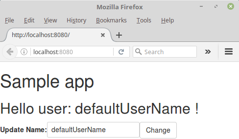

# 04 Callback + State

In this sample we are going to refactor the previous sample **03 State**.

We'll update the name property only when the user clicks on
a _change_ button, we will simplify the event itself as well.

Obviously, we will take the sample **03 State** as a starting point.

Summary steps:

- Add a button to the `EditName` component and a handler function for this.
- Submit the name only when the user clicks on the button.
- Update the `app` component to handle the new simplified event.

## Prerequisites

Install [Node.js and npm](https://nodejs.org/en/) (v6.6.0) if they are not already installed on your computer.

> Verify that you are running at least node v6.x.x and npm 3.x.x by running `node -v` and `npm -v` in a terminal/console window. Older versions may produce errors.

## Steps to build it

- Copy the content of the `03 State` folder to an empty folder for the sample
and make this your current folder.

- Install the npm packages described in the `package.json` and verify that it works:

```bash
npm install
```

- Since we are going to use an internal handler, we'll transform the `NameEditComponent`
from a stateless component into a class component, then we will add some refactor on the naming.

 The `nameEdit.tsx` file should looks like this:

```diff
import * as React from 'react';
import {Fragment} from 'react';


interface Props {
-  userName : string;
-  onChange : (event) => void;
+  initialUserName: string;
+  onNameUpdated: (newName: string) => any;
}

+ interface State {
+  editingName: string;
+ }


- export const NameEditComponent = (props : Props) => {
-  return (
-    <Fragment>
-      <label>Update name:</label>
-      <input value={props.userName} onChange={props.onChange}/>
-    </Fragment>
-  );
-}

+ export class NameEditComponent extends React.Component<Props, State> {
+ 
+   constructor(props: Props) {
+     super(props);
+     // Watch out what would happen if we get this user name via an AJAX callback
+     // you will find a different implementatin on 05 sample
+     this.state = {editingName: this.props.initialUserName};
+   }
+
+ onChange = (event) => {
+   this.setState({editingName: event.target.value});
+ }
+
+ onNameSubmit = (event: any): any => {
+   this.props.onNameUpdated(this.state.editingName);
+ }
+
+  public render() {
+    return (
+      <>
+        <label>Update Name:</label>
+        <input value={this.state.editingName} onChange={this.onChange} />
+        <button className="btn btn-default" onClick={this.onNameSubmit}>Change</button>
+      </>
+    );
+  }
+ }
```

- Let's wire this up in the `app.tsx` file.

_./src/app.tsx_

```diff
export class App extends React.Component<Props, State> {
  constructor(props : Props) {
    super(props);

    this.state = {userName: 'defaultUserName'};
  }

-  setUsernameState = (event) => {
-    this.setState({userName : event.target.value})
-  }

+  setUsernameState = (newName: string) => {
+    this.setState({userName: newName});
+  }

  public render() {
    return (
      <React.Fragment>
        <HelloComponent userName={this.state.userName}/>
-        <NameEditComponent userName={this.state.userName} onChange={this.setUsernameState}/>
+        <NameEditComponent initialUserName={this.state.userName} onNameUpdated={this.setUsernameState}/>
      </React.Fragment>
    );
  }
}
```


 Now we've got a clear event, strongly typed and simplified (straight forward).

- Let's give it a try:

  ```bash
  npm start
  ```

- Then, load http://localhost:8080/ in a browser to see the output.

 

 Now, the greeting only change when the user clicks on the change button.

> What happens if we simulate an AJAX call, let's place in the app on componentWillMount a timeout and set the name value.